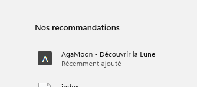

# 🌙 AgaMoon

Site web éducatif sur la Lune, réalisé durant le **DemoMot 2025-2026** — puis transformé en application web installable (PWA)

**[Ouvrir AgaMoon](https://agashae.github.io/MoonWebsite/)**

---

## À propos du projet

**AgaMoon** est un site web dédié à la Lune : données scientifiques, phases lunaires, histoire de l'exploration spatiale et galerie photo personnelle prise à l'iPhone 16 et au Samsung S24 Ultra.

Le projet a été réalisé entièrement en **HTML / CSS** dans le cadre du **DemoMot**, du **01.06.2026** au **09.06.2026**.

---

## 📋 Cahier des charges – AgaMoon

**Agashae Premakumar – CIN1D**  
Vennes  
DemoMot  
2025-2026

### Spécifications

| Élément | Description |
|---------|-------------|
| **Titre** | AgaMoon |
| **Description** | Site web éducatif sur la Lune, réalisé durant le DemoMot 2025-2026. Il est dédié à la Lune : données scientifiques, phases lunaires, histoire de l'exploration spatiale et galerie photo personnelle. |
| **Matériel et logiciels** | Visual Studio Code, HTML5, CSS3 |
| **Prérequis** | Être motivé !, I293 |

### Cahier des charges

**Objectifs et portée du projet (objectifs SMART)**  
Le but est de créer un site sur une de mes passions : l'espace et plus précisément sur la Lune. Apprendre des notions sur la Lune et faire découvrir à d'autres personnes.

**Fonctionnalités requises**
- Afficher des informations générales sur la Lune
- Présenter les huit phases lunaires avec une illustration pour chacune
- Mettre à disposition une galerie de photographies de la Lune
- Avoir une navigation simple et intuitive sur une seule page
- Être accessible depuis un navigateur web
- Être responsive

**Planification Initiale**  
Début du projet : 01.06.26  
Fin du projet : 26.06.26

| Étape | Durée | Date | Description générale |
|-------|-------|------|---------------------|
| Découverte du projet | 1 séquence de 2 périodes | 01.06.26 | Découvrir le but du projet |
| Choix projet | 1 séquence de 3 périodes | 01.06.26 | Choisir tous les projets que l'on va faire |
| Lecture du CdC et répartition des tâches | 1 séquence de 2 périodes | 01.06.26 | Comprendre les objectifs, distribuer les responsabilités dans l'équipe |
| Création de notre CdC | 1 séquence de 3 périodes | 02.06.26 | Créer le CdC du jeu avec tous les objectifs du projet |
| Rédaction des règles du jeu | 1 séquence de 2 périodes | 02.06.26 | Écrire les règles complètes, définir le déroulement d'une partie |
| Élaboration de la banque de questions | 1 séquence de 3 périodes | 02.06.26 | Rédiger des questions par catégorie |
| Test interne du jeu | 1 séquence de 2 périodes | 04.06.26 | Jouer une partie test, identifier les problèmes et ajuster |
| Finalisation du CdC | 1 séquence de 3 périodes | 04.06.26 | Compléter le CdC de projet |
| Projet Personnel | Le temps qui reste | 04.06.26 – 24.06.26 | Création d'un projet personnel dans le cadre du DemoMot |
| Présentation en classe | 1 séquence de 2 périodes | 24.06.26 | Présenter le projet DemoMot et mon projet personnel + faire jouer la classe |

---

## 📝 Journal de travail

| Étape | Durée | Date |
|-------|-------|------|
| Découverte du projet | 1 séquence de 2 périodes | 01.06.26 |
| Choix projet | 1 séquence de 1 période | 01.06.26 |
| Lecture du CdC et répartition des tâches | 1 séquence de 2 périodes | 01.06.26 |
| Création de notre CdC | 1 séquence de 1 période | 01.06.26 |
| Rédaction des règles du jeu | 1 séquence de 1 période | 01.06.26 |
| Élaboration de la banque de questions | 1 séquence de 2 périodes | 02.06.26 |
| Aider Noah à faire le AideCode pour le cadavre exquis | 1 séquence de 2 périodes | 02.06.26 |
| Création de la vidéo de présentation du jeu | 1 séquence de 1 période | 02.06.26 |
| Aider Nathan avec son problème d'envoi de vidéo sur PC | 1 séquence de 1 période | 02.06.26 |
| Aider Liam avec son PowerPoint | 1 séquence de 1 période | 02.06.26 |
| Test interne du jeu | 1 séquence de 1 période | 02.06.26 |
| Parler de nos projets et problèmes avec M. Duding pour les résoudre | 1 séquence de 2 périodes | 04.06.26 |
| Création d'un fichier Word pour parler de nos besoins et des solutions aux problèmes possibles pour les 3 projets | 1 séquence de 2 périodes | 04.06.26 |
| Faire des tests avec des VM pour contrôler à distance PC1 vers PC2 avec toutes les apps possibles | 1 séquence de 3 périodes | 04.06.26 |
| Projet personnel, création du projet sur GitHub et recherche d'idées | 1 séquence de 2 périodes | 04.06.26 |
| Projet personnel, création de la page de base et structure HTML/Figma | 1 séquence de 4 périodes | 05.06.26 |
| Projet personnel, ajout du CSS, finalisation avec images de Massimo | 1 séquence de 5 périodes | 08.06.26 |
| Démo de chaque projet de la classe et discussion fonctionnalités/améliorations | 1 séquence de 2 périodes | 08.06.26 |
| Rendre le projet public : AgaMoon et transformation en PWA | 1 séquence de 3 périodes | 09.06.26 |
| Création du Readme et rendre le projet responsive | 1 séquence de 2 périodes | 09.06.26 |
| Apprendre ce qu'est GitHub Pages | 1 séquence de 1 période | 09.06.26 |
| Amélioration de la structure et optimisation du code | 1 séquence de 2 périodes | 09.06.26 |
| **Absent** | 1 séquence de 9 périodes | 11.06.26 |
| Recherche + achat nom de domaine sur Infomaniak + ajout CNAME | 1 séquence de 2 périodes | 12.06.26 |
| Retour de M. Sahli sur nos projets et prise de notes | 1 séquence de 2 périodes | 12.06.26 |
| Aider Liam avec son problème d'écran | 1 séquence de 1 période | 17.06.26 |
| Création du CdC et PowerPoint | 1 séquence de 1 période | 17.06.26 |
| Ajout des sections au CdC | 1 séquence de 4 périodes | 17.06.26 |
| Nettoyer/Structurer code HTML/CSS et repo GitHub | 1 séquence de 2 périodes | 17.06.26 |
| Chercher un nouveau projet (AstroLab en Python) | 1 séquence de 2 périodes | 18.06.26 |
| Découvrir la syntaxe Python | 1 séquence de 1 période | 18.06.26 |
| Créer la première def avec conditions/boucles | 1 séquence de 3 périodes | 18.06.26 |
| Créer la def planètes() avec dictionnaire de données | 1 séquence de 2 périodes | 18.06.26 |
| Vérifier la saisie utilisateur et apprendre return | 1 séquence de 3 périodes | 19.06.26 |
| Rendre le code beau dans le terminal | 1 séquence de 1 période | 19.06.26 |
| Créer la def fusees avec calcul de carburant | 1 séquence de 4 périodes | 19.06.26 |
| Créer la def calculs (poids, hauteur saut, temps voyage, âge cosmique) | 1 séquence de 4 périodes | 22.06.26 |
| Création PowerPoint pour la présentation | 1 séquence de 4 périodes | 22.06.26 |
| Régler problème PWA sur mobile + restructurer repo | 1 séquence de 6 périodes | 23.06.26 |
| Ajout nouvelles images (Rencontre Célestes) | 1 séquence de 2 périodes | 23.06.26 |

---

## 🔍 Analyse

### Temps
Ma planification indique que j'ai fini le projet Portes Ouvertes le 4 juin, et que durant le temps restant, j'ai réalisé mon projet personnel. Le 24 juin, c'était la présentation.

Cette planification a été respectée : le 4 juin, j'ai effectivement fini le projet et commencé le projet personnel.

Pour le projet personnel, c'était sur le temps restant, sans planification détaillée. J'ai fait un cahier des charges, mais le projet a pris plus de temps que prévu. J'ai donc amélioré mon projet et même acheté un nom de domaine : **agashae.space**

**Travail d'équipe et support réalisé :**
- Aider Noah (AideCode cadavre exquis) → 2 périodes
- Création vidéo de présentation du jeu → 1 période
- Aider Nathan (envoi vidéo) → 1 période
- Aider Liam (PowerPoint + problème écran) → 2 périodes
- Parler avec M. Duding + création fichier Word besoins/solutions → 4 périodes
- Tests VM + solutions de contrôle distant (Parsec, Teams, etc.) → 3 périodes
- Démo des projets de la classe → 2 périodes
- Retour de M. Sahli + prise de notes → 2 périodes

### Points positifs
- Projet Portes Ouvertes terminé
- Beaucoup de travail d'équipe
- Projet personnel très avancé et bien documenté (GitHub, domaine, responsive, PWA)
- Bonne gestion des imprévus

### Points d'amélioration
- La planification initiale est devenue obsolète

### Améliorations apportées
- Hébergement en ligne et accessible publiquement
- Installation sous forme d'application web (PWA)
- Ajout d'un CNAME : agashae.space

### Opportunités
- Refaire de l'HTML/CSS
- Mieux comprendre GitHub
- Découvrir les PWA
- Découvrir les CNAME

### Utilisation de l'IA
L'IA a été utilisée pour m'aider à :
- Structurer/nettoyer mon code HTML/CSS
- Création des fichiers JS/JSON du PWA
- Me renseigner sur le PWA et sur l'utilisation de GitHub
- Ajouter mon CdC dans le Readme

---

## 🌐 Mise en ligne — GitHub Pages

Le site est hébergé gratuitement via **GitHub Pages** et accessible à l'adresse :

> **[https://agashae.github.io/MoonWebsite/](https://agashae.github.io/MoonWebsite/)**

GitHub Pages a été choisi pour deux raisons :
- Accès depuis n'importe quel réseau (y compris celui de l'école)
- HTTPS natif, indispensable pour faire fonctionner la PWA

---

## 📲 Application web installable (PWA)

AgaMoon est une **Progressive Web App** — elle peut être installée comme une vraie application sur mobile et desktop, sans passer par l'App Store ou le Play Store.

### Fonctionnalités PWA

- ✅ Installable sur l'écran d'accueil (iOS Safari & Android Chrome)
- ✅ Fonctionne **hors-ligne** grâce au cache service worker
- ✅ Plein écran sans barre d'adresse (mode `standalone`)
- ✅ Thème et couleurs personnalisés (`#0a0a1a`)

### Comment installer l'app

**Sur Android (Chrome) :**
1. Ouvre le site dans Chrome
2. Appuie sur l'icône ➕ dans la barre d'adresse
3. Appuie sur **Installer**

**Sur iPhone / iPad (Safari) :**
1. Ouvre le site dans Safari
2. Appuie sur le bouton **Partager** ↑
3. Sélectionne **Sur l'écran d'accueil**

**Sur desktop (Chrome) :**
1. Ouvre le site dans Chrome
2. Clique sur l'icône ➕ à droite de la barre d'adresse
3. Clique sur **Installer**

### Captures d'écran

| Installation sur Chrome PC | App ouverte sur Chrome PC | App sur l'écran d'accueil iPhone |
|:-:|:-:|:-:|
|  |  |  |

| App ouverte | Site web dans Safari iPhone | Menu de partage Safari iPhone |
|:-:|:-:|:-:|
|  |  |  |

| App sur PC |
|:-:|
|  |

### Fichiers PWA

**`manifest.json`** — déclare l'app (nom, icône, couleurs, mode d'affichage)

**`service-worker.js`** — met en cache toutes les ressources du site au premier chargement, puis les sert localement pour un accès hors-ligne

> ⚠️ Si ça ne fonctionne pas, vider le cache du navigateur.

---

## 🌍 Domaine personnalisé

Achat sur [Infomaniak](https://www.infomaniak.com/fr) pour environ **4 CHF/an**

> **[https://agashae.space](https://agashae.space)**

---

## 🛠️ Technologies utilisées

| Technologie | Usage |
|-------------|-------|
| HTML5 | Structure des pages |
| CSS3 | Mise en page et animations |
| Web App Manifest | Configuration PWA |
| Service Worker API | Cache hors-ligne |
| GitHub Pages | Hébergement gratuit avec HTTPS |

---

## 📷 Crédits photos

- **Galerie iPhone 16** — Agashae Premakumar
- **Galerie Samsung S24 Ultra** — Massimo Carota
- Photos des phases lunaires — [calendrierlunaire.org](https://calendrierlunaire.org/phases-lunaires)

---

## 🤖 Utilisation de l'IA

L'IA a été utilisée pour m'aider à :
- Structurer/nettoyer mon code HTML/CSS
- Création des fichiers JS/JSON du PWA
- Me renseigner sur le PWA et sur l'utilisation de GitHub
- Ajouter mon CdC dans le Readme

---

*Projet réalisé dans le cadre du DemoMot — 2026*