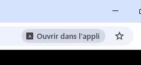
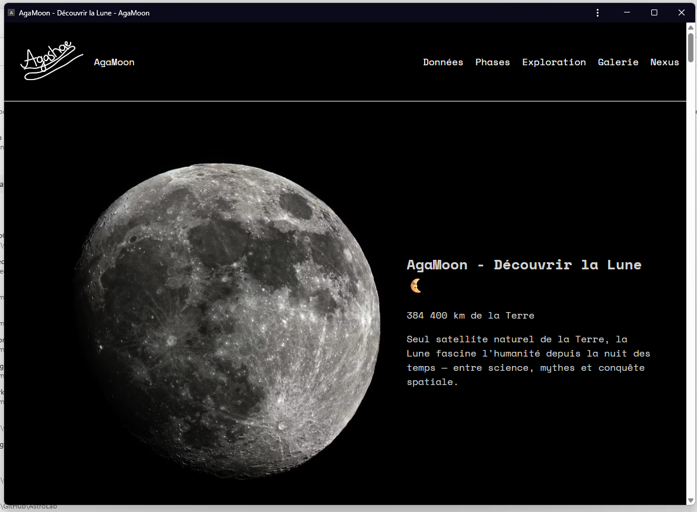
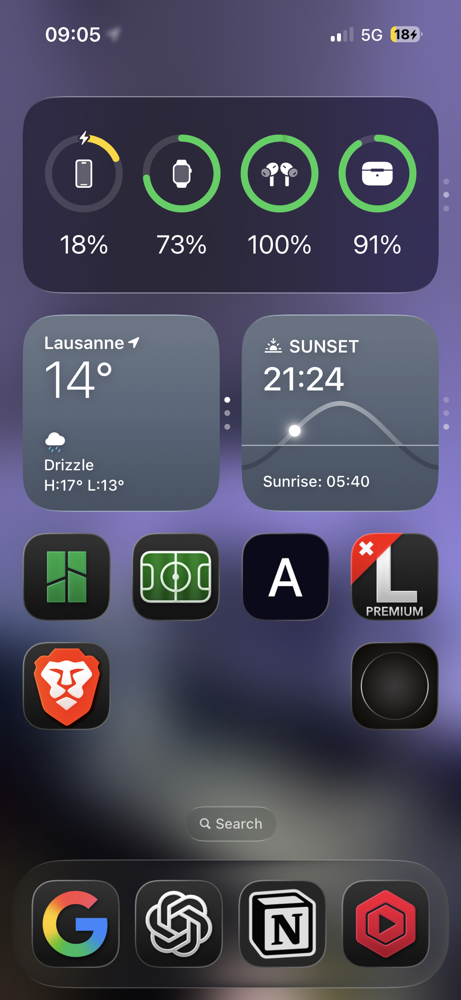
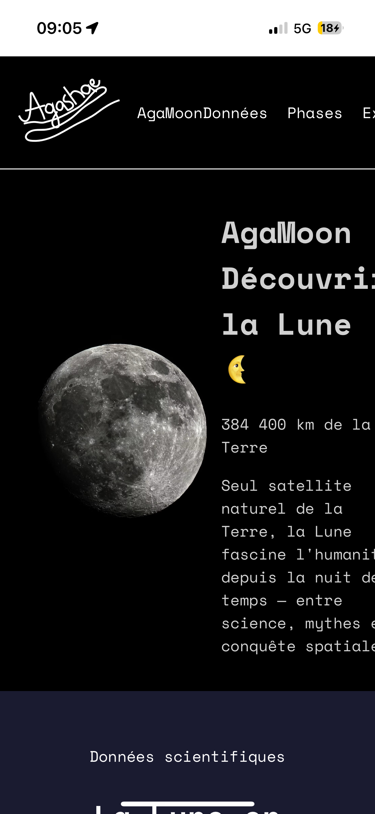
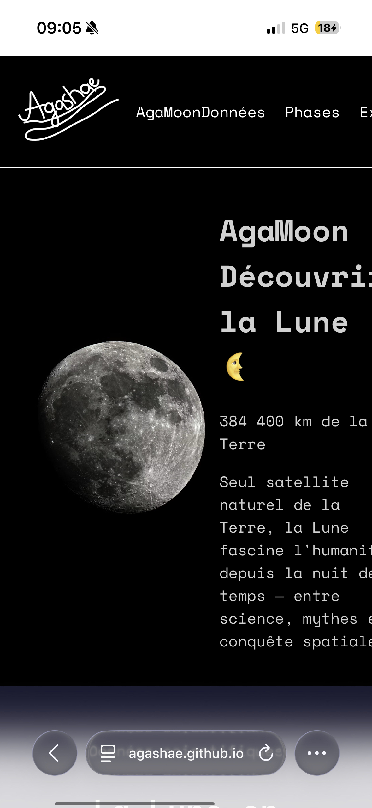
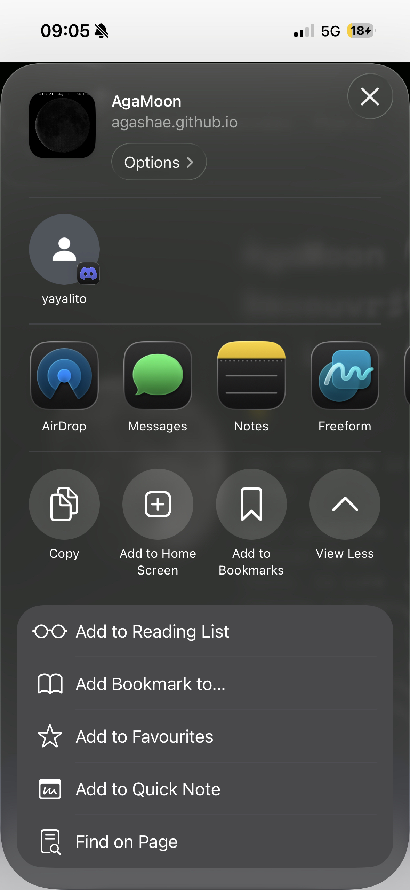

# 🌙 AgaMoon

 Site web éducatif sur la Lune, réalisé durant le **DemoMot 2025-2026** — puis transformé en application web installable (PWA)

 **[Ouvrir AgaMoon](https://agashae.github.io/MoonWebsite/)**

---

## À propos du projet

**AgaMoon** est un site web dédié à la Lune : données scientifiques, phases lunaires, histoire de l'exploration spatiale et galerie photo personnelle prise à l'iPhone 16 et au Samsung S24 Ultra.

Le projet a été réalisé entièrement en **HTML / CSS** dans le cadre du **DemoMot**, du **01.06.2026** au **09.06.2026**.

---

## Les 4 semaines de développement

| Étape | Durée | Date |
|-------|-------|------|
| Découverte du projet | 1 séquence de 2 périodes | 01.06.26 |
| Choix du projet | 1 séquence de 1 période | 01.06.26 |
| Lecture du CdC et répartition des tâches | 1 séquence de 2 périodes | 01.06.26 |
| Création de notre CdC | 1 séquence de 1 période | 01.06.26 |
| Rédaction des règles du jeu | 1 séquence de 1 période | 01.06.26 |
| Élaboration de la banque de questions | 1 séquence de 2 périodes | 02.06.26 |
| Aider Noah à faire le AideCode pour le cadavre exquis | 1 séquence de 2 périodes | 02.06.26 |
| Création de la vidéo de présentation du jeu | 1 séquence de 1 période | 02.06.26 |
| Aider Nathan avec son problème d'envoi de vidéo sur PC | 1 séquence de 1 période | 02.06.26 |
| Aider Liam avec son PowerPoint | 1 séquence de 1 période | 02.06.26 |
| Test interne du jeu | 1 séquence de 1 période | 02.06.26 |
| Discussion avec M. Duding sur les projets et problèmes | 1 séquence de 2 périodes | 04.06.26 |
| Création d'un fichier Word sur les besoins et solutions pour les 3 projets | 1 séquence de 2 périodes | 04.06.26 |
| Tests avec VM pour contrôle à distance PC1→PC2 (Parsec, TeamViewer, Bureau à distance, Teams) | 1 séquence de 3 périodes | 04.06.26 |
| Projet personnel — création sur GitHub, recherche d'idée et inspirations | 1 séquence de 2 périodes | 04.06.26 |
| Projet personnel — page de base, structure HTML / Figma | 1 séquence de 4 périodes | 05.06.26 |
| Projet personnel — CSS, finalisation avec images de Massimo | 1 séquence de 5 périodes | 08.06.26 |
| Démo de chaque projet de la classe, discussion fonctionnalités/améliorations | 1 séquence de 2 périodes | 08.06.26 |
| Rendre AgaMoon public et le transformer en PWA | 1 séquence de 3 périodes | 09.06.26 |
| Création du README et rendu responsive | 1 séquence de 3 périodes | 09.06.26 |
| Amélioration de la structure et optimisation du code | 1 séquence de 2 périodes | 09.06.26 |

---

## 🗂️ Structure du projet

```
MoonWebsite/
├── img/
│   ├── 8Phases/                    # Photos des 8 phases lunaires
│   ├── MoonPhotos/                 # Photos perso (iPhone 16 & Samsung S24 Ultra)
│   │   ├── Agashae/
│   │   └── Massimo/
│   ├── Screenshots/                # Captures d'écran
│   ├── Transparent/                # Planètes roulantes (footer)
│   ├── Images générales/           # Images des missions spatiales et fonds d'écran
│   │   ├── Apollo11.jpg
│   │   ├── Apollo17.jpg
│   │   ├── artemis-3.jpg
│   │   ├── bg-minimalist.jpg
│   │   ├── Chandrayaan-3.jpg
│   │   ├── Chang'e 4.jpg
│   │   ├── Luna2.jpg
│   │   ├── Luna9.jpg
│   │   ├── moon-29.gif
│   │   ├── photo-1657637760839-772d81f3e334.jpg
│   │   └── TheHuntforArtemis.jpeg
│   └── LogoWebSite.png             # Logo AgaMoon
├── CNAME                           # Configuration du domaine personnalisé (si GitHub Pages)
├── index.html                      # Page principale
├── style.css                       # Feuilles de style
├── manifest.json                   # Configuration PWA
├── service-worker.js               # Gestion du cache hors-ligne
└── README.md                       # Documentation du projet
```

---

## Mise en ligne — GitHub Pages

Le site est hébergé gratuitement via **GitHub Pages** et accessible à l'adresse :

>  **[https://agashae.github.io/MoonWebsite/](https://agashae.github.io/MoonWebsite/)**

GitHub Pages a été choisi pour deux raisons :
- Accès depuis n'importe quel réseau (y compris celui de l'école)
- HTTPS natif, indispensable pour faire fonctionner la PWA

---

## Application web installable (PWA)

AgaMoon est une **Progressive Web App** — elle peut être installée comme une vraie application sur mobile et desktop, sans passer par l'App Store ou le Play Store.

### Fonctionnalités PWA

- ✅ Installable sur l'écran d'accueil (iOS Safari & Android Chrome)
- ✅ Fonctionne **hors-ligne** grâce au cache service worker
- ✅ Plein écran sans barre d'adresse (mode `standalone`)
- ✅ Thème et couleurs personnalisés (`#0a0a1a`)

### Comment installer l'app

**Sur Android (Chrome) :**
1. Ouvre le site dans Chrome
2. Appuie sur l'icône ➕ dans la barre d'adresse
3. Appuie sur **Installer**

**Sur iPhone / iPad (Safari) :**
1. Ouvre le site dans Safari
2. Appuie sur le bouton **Partager** ↑
3. Sélectionne **Sur l'écran d'accueil**

**Sur desktop (Chrome) :**
1. Ouvre le site dans Chrome
2. Clique sur l'icône ➕ à droite de la barre d'adresse
3. Clique sur **Installer**

### Captures d'écran

| Installation sur Chrome PC | App ouverte sur Chrome PC | App sur l'écran d'accueil iPhone (A) |
|:-:|:-:|:-:|
|  |  |  |

| App ouverte | Site web dans Safari iPhone | Menu de partage Safari iPhone |
|:-:|:-:|:-:|
|  |  |  |

### Fichiers PWA
>Cette partie, c'est Claude qui m'a aidé à la réalisé.

**`manifest.json`** — déclare l'app (nom, icône, couleurs, mode d'affichage)

**`service-worker.js`** — met en cache toutes les ressources du site au premier chargement, puis les sert localement pour un accès hors-ligne

> Si ça ne marche pas, vider le cache

---
## CNAME
achat sur http://infomaniak.com/fr pour ~ 4.-/an
>  **[https://agashae.space](https://agashae.space)**


## 🛠️ Technologies utilisées

| Technologie | Usage |
|-------------|-------|
| HTML5 | Structure des pages |
| CSS3 | Mise en page et animations |
| Web App Manifest | Configuration PWA |
| Service Worker API | Cache hors-ligne |
| GitHub Pages | Hébergement gratuit avec HTTPS |

---

## 📷 Crédits photos

- **Galerie iPhone 16** — Agashae Premakumar
- **Galerie Samsung S24 Ultra** — Massimo Carota
- Photos des phases lunaires — [calendrierlunaire.org](https://calendrierlunaire.org/phases-lunaires)

---

## Utilisation de l'IA
L’IA a été utilisé pour m’aider à :
•	Structurer/nettoyer mon code HTML/CSS
•	Création des fichiers JS/JSON du PWA
•	Me renseigner sur le PWA et sur l’utilisation de GitHub
•	Ajouter mon CdC dans le Readme


*Projet réalisé dans le cadre du DemoMot — 2026*